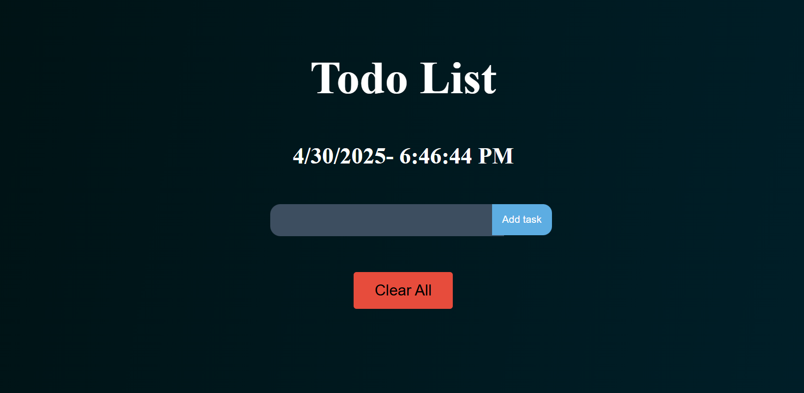
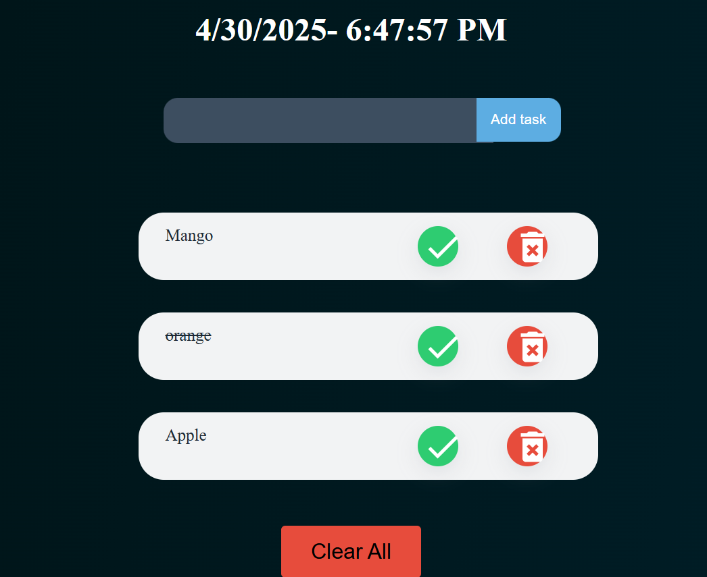

# ToDo List App

## Overview

A To-Do List App in React lets users add, view, and delete tasks. It uses React's useState hook to keep track of the list of tasks. Users can type a task in an input box and click an "Add" button to save it to the list. Each task appears below with a "Delete" button next to it, which removes the task when clicked. You can also add extra features like marking tasks as completed or editing them. It's a great beginner project to learn how React works with components and state.

## Badges

- [![Vite][Vite.js]][Vite-url]
- [![React][React.js]][React-url]

- [![Netlify][Netlify-badge]][Netlify-url]


[linkedin-shield]: https://img.shields.io/badge/-LinkedIn-black.svg?style=for-the-badge&logo=linkedin&colorB=555
[linkedin-url]: https://linkedin.com/in/othneildrew
[Vite.js]: https://img.shields.io/badge/Vite-20232A?style=for-the-badge&logo=vite&logoColor=61DAFB
[Vite-url]: https://vitejs.dev/
[React.js]: https://img.shields.io/badge/React-20232A?style=for-the-badge&logo=react&logoColor=61DAFB
[React-url]: https://reactjs.org/

[Tailwind-url]: https://firebase.google.com/
[Netlify-url]: https://www.netlify.com
[Netlify-badge]: https://www.netlify.com/img/global/badges/netlify-light.svg

## Live Demo

You can try out the ToDo list App here:

- [(dolistapp2.netlify.app/)](https://dolistapp2.netlify.app/)
  


## Screenshots






## Features

✅ Add Task – Easily add new tasks using the input field.

🗑️ Delete Task – Remove any task with a single click.

✔️ Mark as Completed – Click on a task to mark it as done or undone.

- Responsive Design: Optimized for various screen sizes and devices, ensuring a seamless user experience across desktop and mobile platforms.

## Usage/Examples

1.Open the app
Go to the live site (if deployed on Netlify) or run it locally with npm run dev.

2.Add a Task
Type your task in the input box and click the Add button. The task will appear in the list.

3.Mark as Completed
Click on a task to toggle it between completed and not completed. Completed tasks may appear with a line through them (✔️).

4.Delete a Task
Click the Delete (🗑️) button next to a task to remove it from the list.

## Setup or Run Locally

To run the To-do list locally on your machine, follow these steps:

1. Clone the repository to your local machine:

```bash
  git clone https://github.com/your-username/todo-app.git
```

2. Navigate to the project directory:

```bash
cd todo_app
```

3. Install dependencies using npm or yarn:

```bash
npm install
```

or

```bash
yarn install
```

4. Start the development server (vite.js script):

```bash
npm run dev
```

5. Open your web browser and navigate to http://localhost:5173 to view the application.


## Credits

- Exchange rate data provided by [Frankfurter](https://www.frankfurter.app/).

- Built with ❤️ by [Mamata Patil](https://www.linkedin.com/in/mamata-patil12/) - [https://www.linkedin.com/in/mamata-patil12]

## Feedback

If you have any feedback, please reach out to me at mamatapatil7666@gmail.com or https://www.linkedin.com/in/mamata-patil12

## Support

For support, email mamatapatil7666@gmail.com or follow me on [LinkedIn](https://www.linkedin.com/in/mamata-patil12).
